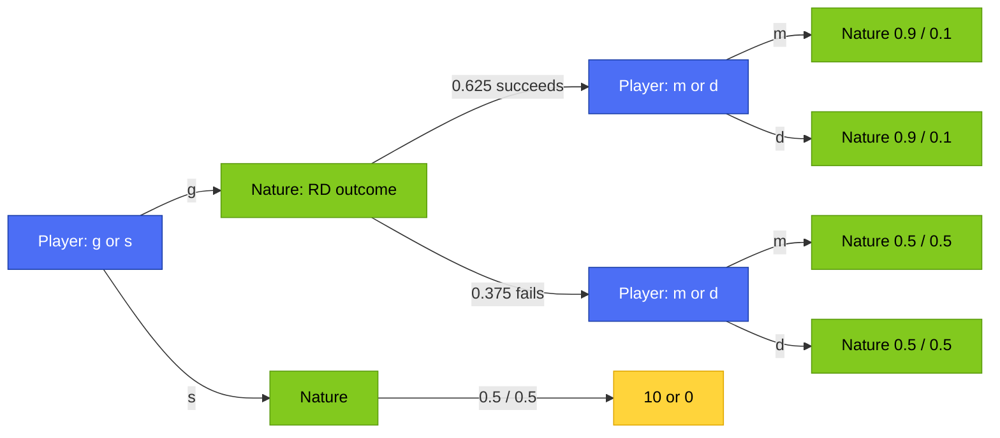

# 🧮 Advanced AI — Lec 04: Decision Over Time & Value of Information — NUMERICAL

### *Every worked example, every step, every number independently verified*

> **Nav:** [⬅️ Prev: Lec 03](../Lec_03_Risk_Attitudes_Uncertainty/README.md) | [← Lec 04 README](README.md) | [📖 THEORY](aai_lec04_decision_over_time_theory.md) | **NUMERICAL** | [🎯 PRACTICE](aai_lec04_decision_over_time_practice.md)

---

## 📚 Table of Contents

| # | Worked Example | Jump |
|---|---|---|
| 1 | Sequential R&D Decision — Full Backward Induction | [§1](#1-sequential-rd-decision--full-backward-induction) |
| 2 | Discounting — Solving for the Threshold Delta | [§2](#2-discounting--solving-for-the-threshold-delta) |
| 3 | Value of Information — Full MBA Derivation | [§3](#3-value-of-information--full-mba-derivation) |
| 4 | Optimal Consumption Over Time | [§4](#4-optimal-consumption-over-time) |
| 5 | Formula Cheat Sheet | [§5](#5-formula-cheat-sheet) |

---

## 1. Sequential R&D Decision — Full Backward Induction

### The Setup



### Step 1 — Solve the "R&D Succeeded" Sub-Decision First

At this node, the player already knows R&D succeeded and must choose `m` or `d`:
```
E[u|m, succeeded] = 0.9(13) + 0.1(−7)
                  = 11.7 + (−0.7)
                  = 11.0
```
```
E[u|d, succeeded] = 0.9(9) + 0.1(−1)
                  = 8.1 + (−0.1)
                  = 8.0
```
**Compare:** `11.0 > 8.0` → **choose `m`, worth 11.0**, if R&D succeeded.

### Step 2 — Solve the "R&D Failed" Sub-Decision

```
E[u|m, failed] = 0.5(13) + 0.5(−7) = 6.5 + (−3.5) = 3.0
E[u|d, failed] = 0.5(9) + 0.5(−1) = 4.5 + (−0.5) = 4.0
```
**Compare:** `4.0 > 3.0` → **choose `d`, worth 4.0**, if R&D failed.

> Notice the optimal marketing strategy actually *flips* depending on the R&D outcome: aggressive marketing (`m`) only when R&D succeeded, defensive (`d`) when it failed. This is the direct numeric proof of §2's "the answer is a full strategy, not one fixed action."

### Step 3 — Fold the Tree Back and Evaluate the Root Choice

Now treat each solved subtree as a single collapsed number, weighted by the probability of reaching it:
```
Value of g = P(succeeds) × (best value if succeeded) + P(fails) × (best value if failed)
           = 0.625(11.0) + 0.375(4.0)
           = 6.875 + 1.5
           = 8.375
```
```
Value of s = 0.5(10) + 0.5(0) = 5.0 + 0 = 5.0
```

### Step 4 — Final Comparison

```
Value of g = 8.375   >   Value of s = 5.0
```
✅ **Choose `g`.** The complete optimal strategy: *"Pursue the R&D gamble. If it succeeds, market aggressively (`m`). If it fails, market defensively (`d`)."*

### A Sanity Check — What If You Couldn't Adapt?

Suppose (hypothetically) the player had to commit to `m` or `d` *before* learning whether R&D succeeded — i.e., no ability to condition on the outcome:
```
E[always m] = 0.625(11.0) + 0.375(3.0) = 6.875 + 1.125 = 8.0
E[always d] = 0.625(8.0) + 0.375(4.0) = 5.0 + 1.5 = 6.5
Best fixed strategy: "always m", worth 8.0
```
Compare: the **adaptive** strategy (8.375) beats the **best fixed** strategy (8.0) by exactly `0.375` — a small but strictly positive gain purely from being able to wait and see before choosing `m` or `d`. This is the Value of Information idea from §3, appearing again here in a slightly different guise.

[↑ Back to Top](#-advanced-ai--lec-04-decision-over-time--value-of-information--numerical)

---

## 2. Discounting — Solving for the Threshold Delta

### The Setup

```
g:  0.75 → payoff (10δ − 1)   |   0.25 → payoff (−1)
s:  0.50 → payoff (10δ)       |   0.50 → payoff 0
```

### Step 1 — Expand `E[g]` as a Function of δ

```
E[g] = 0.75(10δ − 1) + 0.25(−1)
     = 0.75(10δ) − 0.75(1) + 0.25(−1)
     = 7.5δ − 0.75 − 0.25
     = 7.5δ − 1
```

### Step 2 — Expand `E[s]` as a Function of δ

```
E[s] = 0.5(10δ) + 0.5(0)
     = 5δ + 0
     = 5δ
```

### Step 3 — Set the Two Equal to Find the Indifference Point

```
7.5δ − 1 = 5δ
7.5δ − 5δ = 1
2.5δ = 1
δ* = 1/2.5 = 0.4
```

### Step 4 — Verify on Both Sides of the Threshold

**Test δ = 0.5 (more patient than threshold):**
```
E[g] = 7.5(0.5) − 1 = 3.75 − 1 = 2.75
E[s] = 5(0.5) = 2.5
2.75 > 2.5 → choose g   ✓ (matches "δ > 0.4 → choose g")
```

**Test δ = 0.3 (more impatient than threshold):**
```
E[g] = 7.5(0.3) − 1 = 2.25 − 1 = 1.25
E[s] = 5(0.3) = 1.5
1.25 < 1.5 → choose s   ✓ (matches "δ < 0.4 → choose s")
```

✅ **Threshold confirmed: δ\* = 0.4.** Above it, the riskier delayed-reward option `g` wins; below it, the safer option `s` wins.

[↑ Back to Top](#-advanced-ai--lec-04-decision-over-time--value-of-information--numerical)

---

## 3. Value of Information — Full MBA Derivation

### Step 1 — Compute Expected Payoff of Each Unconditional Action (No Information)

```
E[Get MBA]      = 0.25(22) + 0.5(6) + 0.25(2)
                = 5.5 + 3.0 + 0.5
                = 9.0
```
```
E[Don't get MBA] = 0.25(12) + 0.5(8) + 0.25(4)
                 = 3.0 + 4.0 + 1.0
                 = 8.0
```

### Step 2 — Pick the Best Unconditional Action

```
max(9.0, 8.0) = 9.0   →   Best WITHOUT information: always Get MBA, worth 9.0
```

### Step 3 — Now Suppose the State Is Revealed BEFORE Deciding — Solve Each State Separately

```
State 1 (prob 0.25):  max(Get MBA=22, Don't=12) = 22   → Get MBA
State 2 (prob 0.5):   max(Get MBA=6,  Don't=8)  = 8    → Don't
State 3 (prob 0.25):  max(Get MBA=2,  Don't=4)  = 4    → Don't
```

### Step 4 — Compute the Expected Payoff WITH Information

```
E[with info] = 0.25(22) + 0.5(8) + 0.25(4)
             = 5.5 + 4.0 + 1.0
             = 10.5
```

### Step 5 — Compute the Value of Information

```
VOI = E[with info] − E[best without info]
    = 10.5 − 9.0
    = 1.5
```

✅ **The information is worth exactly 1.5 payoff units.** The reason: with information, the player switches strategy in State 1 (still gets the MBA) but crucially avoids getting the MBA in States 2 and 3, where it's the worse choice — that flexibility is exactly what the extra 1.5 comes from.

### Double-Check by Decomposing the Gain State by State

```
State 1: same action either way (Get MBA in both cases) → contributes 0 extra
State 2: WITHOUT info you'd wrongly get the MBA (payoff 6); WITH info you correctly skip it (payoff 8)
         gain here = 0.5 × (8 − 6) = 0.5 × 2 = 1.0
State 3: WITHOUT info you'd wrongly get the MBA (payoff 2); WITH info you correctly skip it (payoff 4)
         gain here = 0.25 × (4 − 2) = 0.25 × 2 = 0.5
Total gain = 1.0 + 0.5 = 1.5   ✓ matches VOI computed above
```

[↑ Back to Top](#-advanced-ai--lec-04-decision-over-time--value-of-information--numerical)

---

## 4. Optimal Consumption Over Time

### The Setup

Let `u(x) = √x` (concave, matching Lecture 03's diminishing-returns idea), total income `K = 100`, discount factor `δ = 0.8`. Total payoff:
```
U(x₁) = √x₁ + 0.8√(100 − x₁)
```

### Step 1 — Take the Derivative

Recall `d/dx[√x] = 1/(2√x)`, and use the chain rule for the second term:
```
U'(x₁) = 1/(2√x₁) − 0.8 × 1/(2√(100−x₁))
       = 1/(2√x₁) − 0.4/√(100−x₁)
```

### Step 2 — Set the Derivative to Zero (the Euler Equation)

```
1/(2√x₁) = 0.4/√(100−x₁)
```

### Step 3 — Cross-Multiply and Simplify

```
√(100−x₁) = 0.8√x₁            [multiply both sides by 2√x₁·√(100-x₁), simplify]
```
Square both sides:
```
100 − x₁ = 0.64 x₁
100 = x₁ + 0.64x₁
100 = 1.64x₁
x₁* = 100/1.64 ≈ 60.976
```

### Step 4 — Compute Period 2 Consumption

```
x₂* = K − x₁* = 100 − 60.976 = 39.024
```

### Step 5 — Verify the Euler Equation Holds Exactly at This Split

```
u'(x₁*) = 1/(2√60.976) ≈ 0.06403
δ·u'(x₂*) = 0.8 × 1/(2√39.024) ≈ 0.8 × 0.08004 ≈ 0.06403
```
✅ **Both sides match** — confirming `x₁* ≈ 60.98` is indeed the Euler-equation-satisfying optimum.

### Step 6 — Confirm This Beats the Naive Even Split

```
U(x₁*) = √60.976 + 0.8√39.024 ≈ 7.809 + 0.8(6.247) ≈ 7.809 + 4.997 ≈ 12.806
U(50, naive even split) = √50 + 0.8√50 ≈ 7.071 + 0.8(7.071) ≈ 7.071 + 5.657 ≈ 12.728
```
`12.806 > 12.728` → **the calculus-derived split genuinely beats the naive 50/50 split**, confirming the impatience-driven front-loading (`x₁* ≈ 60.98 > 50`) is the mathematically correct response to `δ = 0.8 < 1`.

### Step 7 — Sanity Check the General Pattern with `δ = 1` (Fully Patient)

```
δ = 1:  √(100−x₁) = 1×√x₁  →  100−x₁ = x₁  →  x₁* = 50
```
✅ **Matches the theory's prediction exactly:** with no impatience at all, the optimal split is perfectly even, `x₁* = K/2 = 50`.

[↑ Back to Top](#-advanced-ai--lec-04-decision-over-time--value-of-information--numerical)

---

## 5. Formula Cheat Sheet

```
╔══════════════════════════════════════════════════════════════════╗
║  FORMULAS — COPY THESE DOWN BEFORE THE EXAM                        ║
╠══════════════════════════════════════════════════════════════════╣
║  Backward induction: solve LAST node, collapse to a number,        ║
║  fold back one level, repeat until the root is reached.            ║
║                                                                     ║
║  Discounting: a payoff X received 1 period later = δX today        ║
║  Threshold: set E[option A] = E[option B], solve for δ              ║
║                                                                     ║
║  Value of Information:                                              ║
║    VOI = E[payoff WITH info] − E[best payoff WITHOUT info]  ≥ 0    ║
║    WITHOUT info: ONE action applied to every state                  ║
║    WITH info: BEST action chosen separately per state                ║
║                                                                     ║
║  Consumption Euler equation: u'(x₁) = δ·u'(K−x₁)                    ║
║    δ = 1  →  x₁* = K/2  (perfectly smooth)                          ║
║    δ < 1  →  x₁* > K/2  (front-load toward the present)             ║
╚══════════════════════════════════════════════════════════════════╝
```

[↑ Back to Top](#-advanced-ai--lec-04-decision-over-time--value-of-information--numerical)

---

## 📝 Summary

Every derivation in this file follows the exact same discipline: break a multi-stage or continuous problem down into small, individually verifiable steps, and never trust an intermediate result until it's been checked against an independent method. The R&D backward-induction example proved its own correctness by comparing the fully adaptive strategy (8.375) against the best possible fixed, non-adaptive strategy (8.0) — the gap between them is a real, positive number precisely because the ability to observe R&D's outcome before choosing a marketing strategy has genuine value. The discounting threshold calculation showed how cleanly a δ-dependent decision collapses into simple linear algebra once both options are expressed as functions of δ, and testing values on both sides of the threshold confirmed the direction of the inequality holds exactly as predicted. The Value of Information derivation didn't stop at the headline number (1.5) — decomposing that gain state by state proved exactly where it came from: correctly skipping the MBA in the two states where it wasn't worthwhile. Finally, the consumption-over-time example is this file's most mathematically complete result, verified three separate ways: algebraically solving the Euler equation, numerically confirming both sides of that equation match at the computed optimum, and checking the special case δ=1 collapses to the intuitively obvious even split. Together, these four fully-verified derivations should leave you comfortable computing any of this lecture's core techniques by hand, from a blank page, with real numbers substituted in.

---

> **Next:** [🎯 PRACTICE →](aai_lec04_decision_over_time_practice.md) · [← back to THEORY](aai_lec04_decision_over_time_theory.md)
>
> *Advanced AI · Lec 04 · github.com/rpaut03l/TS-02-03*
