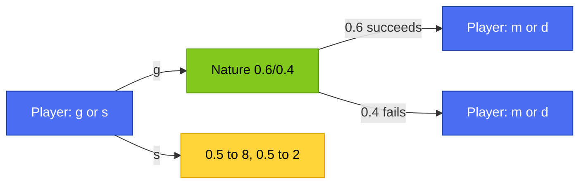

# 🎯 Advanced AI — Lec 04: Decision Over Time & Value of Information — PRACTICE

### *Self-test problems, a Q&A bank, and a mini project — try before you peek*

> **Nav:** [⬅️ Prev: Lec 03](../Lec_03_Risk_Attitudes_Uncertainty/README.md) | [← Lec 04 README](README.md) | [📖 THEORY](aai_lec04_decision_over_time_theory.md) | [🧮 NUMERICAL](aai_lec04_decision_over_time_numerical.md) | **PRACTICE**

---

## 📚 Table of Contents

| # | Section | Jump |
|---|---|---|
| 1 | Backward Induction Practice | [§1](#1-backward-induction-practice) |
| 2 | Discounting Threshold Drills | [§2](#2-discounting-threshold-drills) |
| 3 | Value of Information Drills | [§3](#3-value-of-information-drills) |
| 4 | Consumption Over Time Drills | [§4](#4-consumption-over-time-drills) |
| 5 | Mini Project — Design Your Own Sequential Decision | [§5](#5-mini-project--design-your-own-sequential-decision) |
| 6 | Exam-Style Q&A Bank | [§6](#6-exam-style-qa-bank) |

> 💡 Every problem below is inside a `<details>` block. **Try to solve it on paper first**, then click "Show Answer" to check yourself.

---

## 1. Backward Induction Practice

**Q1.1.** A player chooses `g` or `s`. Choosing `g` leads to Nature revealing success (prob 0.6) or failure (prob 0.4). After success, the player picks `m` (0.8→20, 0.2→−10) or `d` (0.8→12, 0.2→0). After failure, the player picks `m` (0.4→20, 0.6→−10) or `d` (0.4→12, 0.6→0). Choosing `s` gives 0.5→8, 0.5→2. Solve using backward induction: what's the optimal complete strategy?

<details>
<summary>Show Answer</summary>



**Step 1 — solve "succeeded":**
```
E[m|succeeded] = 0.8(20) + 0.2(−10) = 16 − 2 = 14.0
E[d|succeeded] = 0.8(12) + 0.2(0)   = 9.6
Best: m, worth 14.0
```

**Step 2 — solve "failed":**
```
E[m|failed] = 0.4(20) + 0.6(−10) = 8 − 6 = 2.0
E[d|failed] = 0.4(12) + 0.6(0)   = 4.8
Best: d, worth 4.8
```

**Step 3 — fold back to the root:**
```
Value of g = 0.6(14.0) + 0.4(4.8) = 8.4 + 1.92 = 10.32
Value of s = 0.5(8) + 0.5(2) = 5.0
```

`10.32 > 5.0` → ✅ **Choose g. If R&D succeeds, play m. If it fails, play d.**
</details>

---

**Q1.2.** In Q1.1, what would the expected value have been if the player were forced to commit to a single marketing strategy (`m` or `d`) before learning the R&D outcome? How much value does the ability to observe the outcome first add?

<details>
<summary>Show Answer</summary>

```
E[always m] = 0.6(14.0) + 0.4(2.0) = 8.4 + 0.8 = 9.2
E[always d] = 0.6(9.6) + 0.4(4.8) = 5.76 + 1.92 = 7.68
Best fixed strategy: always m, worth 9.2
```
Adaptive strategy (10.32) beats the best fixed strategy (9.2) by `10.32 − 9.2 = 1.12`. This gap is exactly the value of being able to observe R&D's outcome before choosing the marketing strategy — the same logic as the Value of Information (§3).
</details>

---

## 2. Discounting Threshold Drills

**Q2.1.** `g`: 0.6 → `(20δ − 2)`, 0.4 → `−2`. `s`: 0.5 → `12δ`, 0.5 → `0`. Find the threshold δ where a rational player is indifferent between `g` and `s`.

<details>
<summary>Show Answer</summary>

```
E[g] = 0.6(20δ − 2) + 0.4(−2) = 12δ − 1.2 − 0.8 = 12δ − 2
E[s] = 0.5(12δ) + 0.5(0) = 6δ

Set equal: 12δ − 2 = 6δ  →  6δ = 2  →  δ* = 1/3 ≈ 0.333
```
For δ > 1/3, choose g. For δ < 1/3, choose s.
</details>

---

**Q2.2.** Using Q2.1's threshold, would a player with δ = 0.5 choose `g` or `s`? Verify with the actual numbers.

<details>
<summary>Show Answer</summary>

```
E[g] = 12(0.5) − 2 = 6 − 2 = 4.0
E[s] = 6(0.5) = 3.0
4.0 > 3.0 → choose g
```
Matches the rule: δ = 0.5 > 1/3, so `g` should win — confirmed.
</details>

---

## 3. Value of Information Drills

**Q3.1.** A player deciding whether to Invest or Not, across 3 possible market states (probabilities 0.2, 0.5, 0.3): Invest pays (30, 10, −15) across the three states; Don't Invest pays (5, 5, 5) in all states. Compute the Value of Information.

<details>
<summary>Show Answer</summary>

**Step 1 — best unconditional (no info) action:**
```
E[Invest]  = 0.2(30) + 0.5(10) + 0.3(−15) = 6 + 5 − 4.5 = 6.5
E[Don't]   = 0.2(5) + 0.5(5) + 0.3(5) = 5.0
Best without info: Invest, worth 6.5
```

**Step 2 — best action per state (with info):**
```
State 1: max(30, 5) = 30 → Invest
State 2: max(10, 5) = 10 → Invest
State 3: max(−15, 5) = 5 → Don't
E[with info] = 0.2(30) + 0.5(10) + 0.3(5) = 6 + 5 + 1.5 = 12.5
```

**Step 3 — VOI:**
```
VOI = 12.5 − 6.5 = 6.0
```
✅ Information is worth 6.0 — almost entirely because it lets the player avoid the disastrous −15 outcome in State 3 by switching to "Don't Invest" only when that state is revealed.
</details>

---

**Q3.2.** In Q3.1, decompose the VOI state by state to confirm the total.

<details>
<summary>Show Answer</summary>

```
State 1: same action (Invest) either way → contributes 0
State 2: same action (Invest) either way → contributes 0
State 3: WITHOUT info you'd wrongly Invest (−15); WITH info you correctly Don't (5)
         gain = 0.3 × (5 − (−15)) = 0.3 × 20 = 6.0
Total = 0 + 0 + 6.0 = 6.0   ✓ matches Q3.1
```
</details>

---

## 4. Consumption Over Time Drills

**Q4.1.** Using `u(x) = ln(x)`, `K = 200`, `δ = 0.9`, find the optimal `x₁*` and `x₂*`.

<details>
<summary>Show Answer</summary>

**Step 1 — derivative of `u(x)=ln(x)` is `u'(x) = 1/x`.**

**Step 2 — Euler equation:**
```
1/x₁ = 0.9/(200−x₁)
```

**Step 3 — cross-multiply:**
```
200 − x₁ = 0.9x₁
200 = 1.9x₁
x₁* = 200/1.9 ≈ 105.26
x₂* = 200 − 105.26 ≈ 94.74
```
Since δ = 0.9 < 1 (some impatience), `x₁* ≈ 105.26 > K/2 = 100` — confirms front-loading toward the present, exactly as the theory predicts.
</details>

---

**Q4.2.** What would `x₁*` be for the same problem if `δ = 1` (perfectly patient)? Confirm it matches the general rule from the theory file.

<details>
<summary>Show Answer</summary>

```
1/x₁ = 1/(200−x₁)  →  x₁ = 200−x₁  →  2x₁=200  →  x₁* = 100 = K/2
```
✅ Matches the rule exactly: `δ=1` always gives a perfectly even split, `x₁* = K/2`.
</details>

---

## 5. Mini Project — Design Your Own Sequential Decision

No spoiler answer here — genuinely yours to build.

**Task:**
1. Design your own two-stage sequential decision tree, similar to the R&D example: a first-stage choice, a Nature node revealing information, then a second-stage choice that can depend on what Nature revealed. Pick your own probabilities and payoffs.
2. Solve it completely using backward induction: solve each second-stage sub-decision first, fold back, then solve the first-stage choice. State the full optimal contingent strategy in plain English.
3. Compute what the expected value would have been under the *best fixed* (non-adaptive) strategy, and confirm the adaptive strategy's value is at least as high — this gap is your scenario's implicit "value of being able to observe before deciding."
4. Now add a discount factor `δ` to one branch of your tree (some reward arrives later than another) and find the threshold `δ*` at which the optimal first-stage choice would flip.
5. **Bonus:** turn your scenario into a proper Value-of-Information comparison — build a "decide-blind" version and a "decide-after-learning" version of your tree, and compute the exact VOI.

---

## 6. Exam-Style Q&A Bank

<details>
<summary><b>Q. What is backward induction and why is it necessary for multi-stage decisions?</b></summary>

Backward induction solves a sequential decision tree by starting at the last decision nodes, finding the optimal choice there, collapsing that subtree into a single value, and repeating one level back toward the root. It's necessary because later decisions can depend on information revealed after earlier ones, so you can't correctly evaluate an early choice without first knowing how you'd optimally respond to everything that could happen afterward.
</details>

<details>
<summary><b>Q. Why is the output of backward induction called a "strategy" rather than just an "action"?</b></summary>

Because it specifies a complete rule for what to do in every possible situation that could arise at later decision points, not a single fixed action — e.g., "play m if R&D succeeds, play d if it fails."
</details>

<details>
<summary><b>Q. What does a discount factor δ represent, and what range does it take?</b></summary>

δ represents how much a payoff received one period in the future is worth today; δ ∈ (0,1), with smaller δ meaning more impatience (the future is discounted more heavily).
</details>

<details>
<summary><b>Q. How do you find the discount-factor threshold between two options?</b></summary>

Write each option's expected value as a linear function of δ, set the two expressions equal, and solve for δ.
</details>

<details>
<summary><b>Q. Define the Value of Information formula, and state its sign restriction.</b></summary>

VOI = E[payoff with information] − E[best payoff without information]. VOI is always ≥ 0, since the decision-maker can always ignore the information and revert to the best unconditional action.
</details>

<details>
<summary><b>Q. What's the key structural difference between computing expected payoff "with" versus "without" information?</b></summary>

Without information, a single action must be applied uniformly across every possible state. With information, the best action can be chosen separately for each state, since the state is known before the decision is made.
</details>

<details>
<summary><b>Q. State the Euler equation for two-period consumption and explain the intuition.</b></summary>

`u'(x₁) = δ·u'(K−x₁)` — marginal utility from consuming today must equal the discounted marginal utility from consuming tomorrow; if they weren't equal, you could increase total utility by shifting a small amount of consumption from one period to the other.
</details>

<details>
<summary><b>Q. What happens to the optimal consumption split as δ decreases from 1?</b></summary>

The optimal first-period consumption x₁* increases above K/2 — a more impatient consumer shifts consumption earlier, since future utility counts for relatively less in the total payoff.
</details>

[↑ Back to Top](#-advanced-ai--lec-04-decision-over-time--value-of-information--practice)

---

## 📝 Summary

Every drill in this file was built to test the exact same four skills from the theory and numerical files, but with fresh numbers you hadn't already seen worked out. The backward-induction drills reinforced that solving a sequential tree always means starting from its last decisions and folding backward, and Q1.2 specifically proved that the value of being able to adapt your strategy after observing new information is a real, computable, strictly positive number — not just a vague intuition. The discounting drills showed the threshold-finding technique holds up on a completely different set of payoffs, and verifying both sides of the threshold in Q2.2 is exactly the kind of double-check that catches sign errors before they become wrong exam answers. The Value of Information drills went a step further than the main lecture by decomposing the total gain state by state, proving concretely that VOI comes specifically from the states where information changes your optimal action — states where the action doesn't change contribute nothing to VOI at all. The consumption drills, run with a completely different utility function (natural log instead of square root) and different numbers, confirmed the Euler equation and the δ=1 even-split rule generalize far beyond the one example worked out in the numerical file. If the open-ended mini project felt hard, that's a good sign — designing a sequential decision from scratch and solving it completely is the clearest possible proof that these techniques have become genuinely usable tools rather than memorized steps.

---

> **← Back:** [🧮 NUMERICAL](aai_lec04_decision_over_time_numerical.md) · [📖 THEORY](aai_lec04_decision_over_time_theory.md) · [🏠 Lec 04 README](README.md) · [⬅️ Lecture 03](../Lec_03_Risk_Attitudes_Uncertainty/README.md)
>
> *Advanced AI · Lec 04 · github.com/rpaut03l/TS-02-03*
