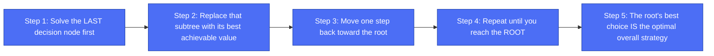
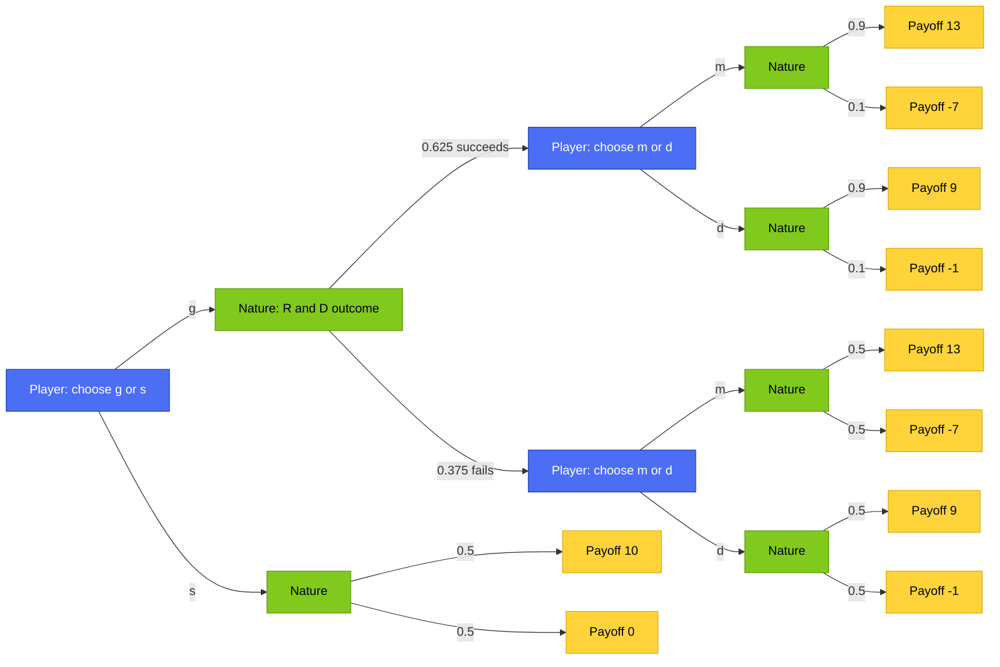
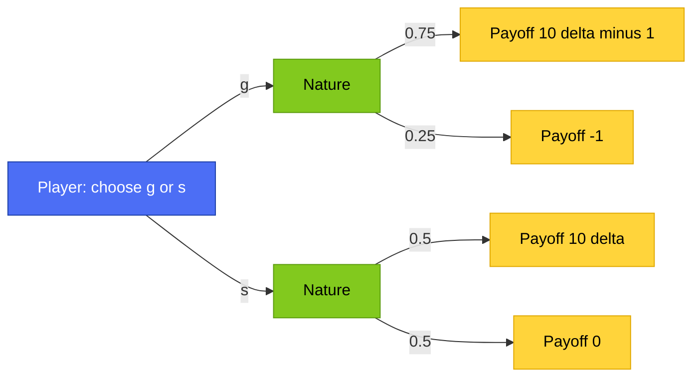
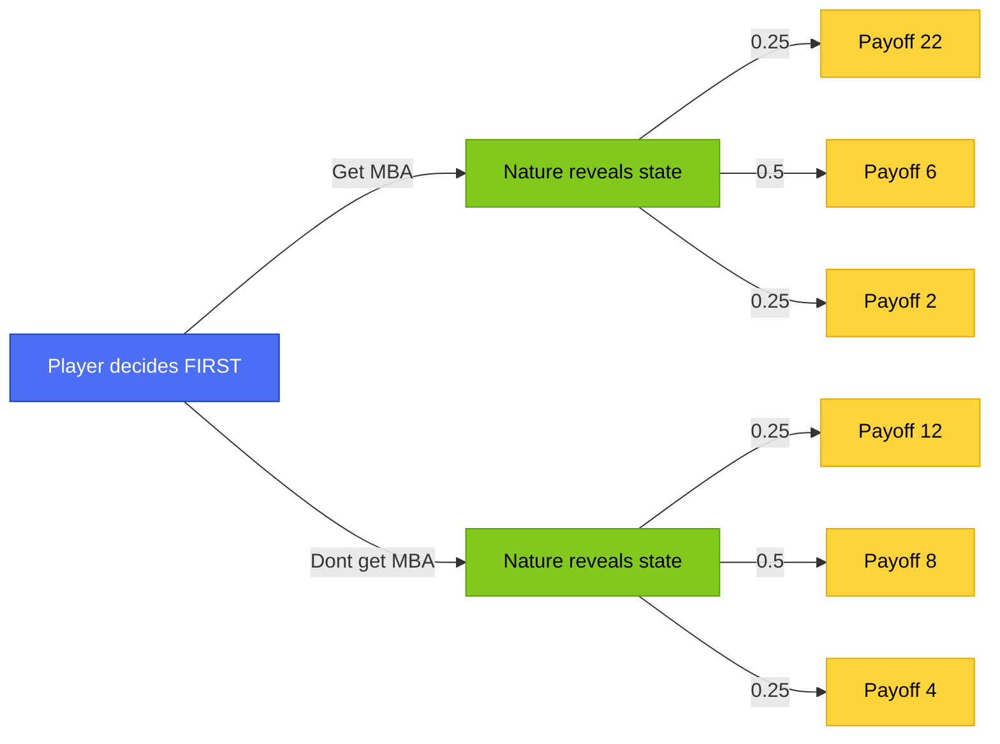
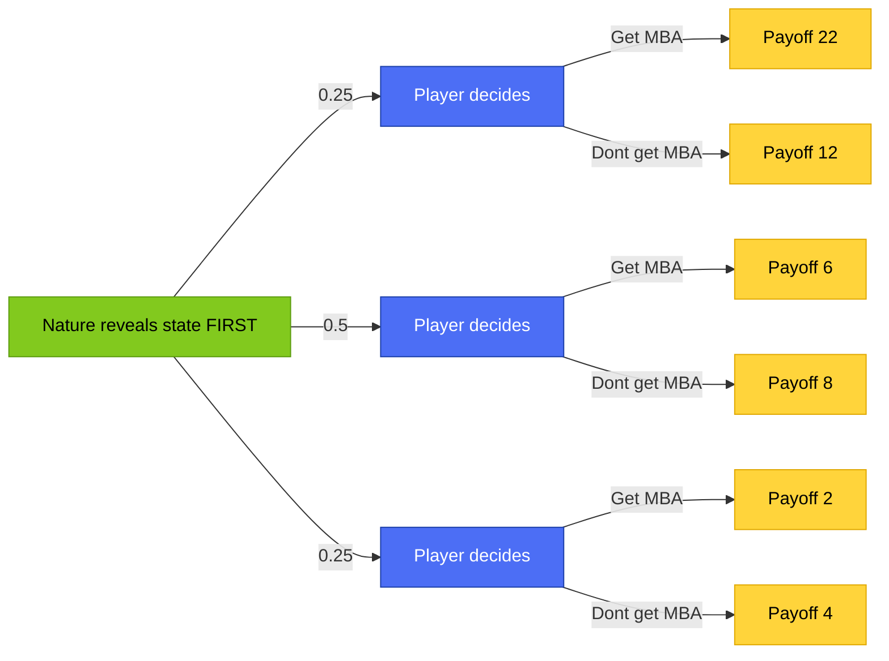
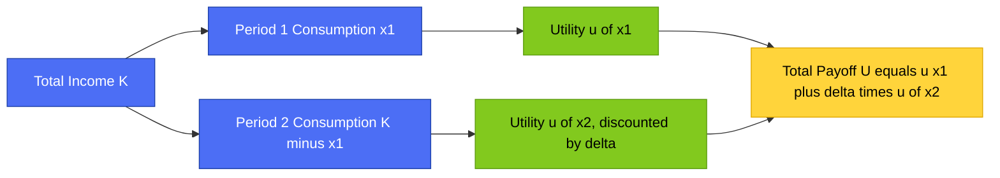

# 📖 Advanced AI — Lec 04: Decision Over Time & Value of Information — THEORY

### *Sequential Decisions · Backward Induction · Discounting · Value of Information · Intertemporal Consumption*

> **Nav:** [⬅️ Prev: Lec 03](../Lec_03_Risk_Attitudes_Uncertainty/README.md) | [← Lec 04 README](README.md) | **THEORY** | [🧮 NUMERICAL](aai_lec04_decision_over_time_numerical.md) | [🎯 PRACTICE](aai_lec04_decision_over_time_practice.md)

---

## 🧠 MNEMONIC: **"SOLVE BACKWARDS, DISCOUNT FORWARD, INFO IS WORTH SOMETHING"**

> **S**equential decisions solved by **B**ackward induction → **D**iscounting shrinks future payoffs → **I**nformation, learned before deciding, is never worth less than zero

Everything in this lecture is Lecture 02's and Lecture 03's tools, stretched across **time**. Up to now, every decision happened once, all at once. This lecture asks: what changes when a decision unfolds in stages, when money later is worth less than money now, and when you might get to *learn something* before you have to commit?

---

## 📚 Table of Contents

| # | Topic | Jump |
|---|-------|------|
| 1 | From One-Shot to Multi-Period Decisions | [§1](#1-from-one-shot-to-multi-period-decisions) |
| 2 | Sequential Decisions & Backward Induction | [§2](#2-sequential-decisions--backward-induction) |
| 3 | Discounting — The Time Value of Money | [§3](#3-discounting--the-time-value-of-money) |
| 4 | The Value of Information | [§4](#4-the-value-of-information) |
| 5 | Application — Optimal Consumption Over Time | [§5](#5-application--optimal-consumption-over-time) |
| 6 | Cheat Sheet & Exam Hacks | [§6](#6-cheat-sheet--exam-hacks) |

---

## 1. From One-Shot to Multi-Period Decisions

### 👶 Easy Story

Imagine choosing a toy from a toy box just once — you look at everything, you pick, done. Now imagine a different toy box: you pick a shelf first, then a curtain opens showing whether that shelf has good toys or bad toys today, and only *then* do you get to pick which exact toy from that shelf. Suddenly your best final pick depends on what the curtain showed you. That's the entire shift this lecture makes: decisions can happen in **stages**, with new information arriving between stages, and a smart player plans for *every* stage in advance, not just the first one.

### Why This Matters

Every tool from [Lecture 01](../Lec_01_Individual_Decision_Problem/README.md) through [Lecture 03](../Lec_03_Risk_Attitudes_Uncertainty/README.md) — actions, outcomes, preferences, utility, expected utility, risk attitudes — still applies exactly as before. What's new is the **shape of the problem**: instead of one flat choice, you now have a genuine tree with multiple *player* decision nodes stacked on top of Nature's random moves, sometimes with Nature revealing something in between two of your own decisions. Solving these trees correctly needs one new technique: **backward induction**.



> 🍼 **Kid version:** Solve the puzzle from the *end* backward, not from the start forward — figure out what you'd do at the very last fork first, then treat that entire last fork as if it were just one single number, and keep folding the tree inward like that until only the very first choice is left.

[↑ Back to Top](#-advanced-ai--lec-04-decision-over-time--value-of-information--theory)

---

## 2. Sequential Decisions & Backward Induction

### 👶 Easy Story

A company is deciding whether to gamble on a risky R&D project (`g`) or play it safe (`s`). If they gamble, Nature first reveals whether the R&D **succeeds** or **fails** — and only *after* learning that, the company picks how aggressively to market the result (`m`, aggressive) or how cautiously (`d`, defensive). The genius move here: the company doesn't have to decide `m` or `d` right now — it gets to wait and see whether R&D worked first, then pick the marketing strategy that fits *that specific outcome*.

### The Full Tree



### The Backward Induction Method, Applied Step by Step

**Step 1 — solve the LAST decisions first** (the `m` vs `d` choices, made *after* R&D's outcome is known). There are two separate copies of this choice — one for each Nature branch:

*If R&D succeeded (you're standing at that node):*
```
E[u|m] = 0.9(13) + 0.1(−7) = 11.7 − 0.7 = 11.0
E[u|d] = 0.9(9) + 0.1(−1) = 8.1 − 0.1 = 8.0
Best choice here: m, worth 11.0
```

*If R&D failed:*
```
E[u|m] = 0.5(13) + 0.5(−7) = 6.5 − 3.5 = 3.0
E[u|d] = 0.5(9) + 0.5(−1) = 4.5 − 0.5 = 4.0
Best choice here: d, worth 4.0
```

**Step 2 — collapse each solved subtree into a single number** (its best achievable value), and fold the tree one level back toward the root:
```
"g, if R&D succeeds" is now worth 11.0
"g, if R&D fails" is now worth 4.0
```

**Step 3 — evaluate the very first choice (`g` vs `s`) using these collapsed values:**
```
Value of g = 0.625(11.0) + 0.375(4.0) = 6.875 + 1.5 = 8.375
Value of s = 0.5(10) + 0.5(0) = 5.0
```

**Step 4 — pick the biggest number at the root, exactly like every prior lecture:**
```
8.375 > 5.0  →  Choose g
```

### The Full Optimal Strategy (Not Just One Number!)

Backward induction doesn't just tell you the best *value* — it tells you the complete **contingent plan**:
```
"Choose g. If R&D succeeds, play m. If R&D fails, play d."
```
This is fundamentally different from picking a single fixed action — it's a full *strategy*, a rule that says what to do in every situation that might arise. Notice that "always play `m`" would actually have been a mistake, since `d` is strictly better once R&D has already failed.

> 🍼 **Kid version:** You don't have to promise now which curtain-shelf toy you'll grab — you just promise to open the curtain first, and *then* grab whichever specific toy turns out to be the best one for whatever's actually behind it.

[↑ Back to Top](#-advanced-ai--lec-04-decision-over-time--value-of-information--theory)

---

## 3. Discounting — The Time Value of Money

### 👶 Easy Story

Would you rather have one cookie right now, or a promise of one cookie tomorrow? Most people (and most rational economic agents) prefer the cookie now — waiting has a cost, even if the cookie itself never changes size. **Discounting** is the mathematical way of writing "a reward received later is worth a bit less than the same reward received immediately."

### The Discount Factor `δ`

```
δ ∈ (0, 1)     "the discount factor"
```
A payoff of `X` received one period from now is only worth `δX` **today**. Smaller `δ` means more impatient (the future is heavily discounted); `δ` close to 1 means very patient (the future is barely discounted at all).

### The Tree



Notice the `−1` in the top branch has **no `δ` attached** — that's an upfront cost paid *today* (an entry fee, an investment), while the `10` reward, if it arrives, only arrives *later* and so gets discounted to `10δ`.

### Solving for a Threshold

**Step 1 — write expected value as a function of `δ`:**
```
E[g] = 0.75(10δ − 1) + 0.25(−1) = 7.5δ − 0.75 − 0.25 = 7.5δ − 1
E[s] = 0.5(10δ) + 0.5(0) = 5δ
```

**Step 2 — find the `δ` where the two options are exactly tied:**
```
7.5δ − 1 = 5δ
2.5δ = 1
δ* = 0.4
```

**Step 3 — interpret the threshold:**
```
If δ > 0.4 (patient enough)  →  choose g
If δ < 0.4 (too impatient)   →  choose s
```

> 🍼 **Kid version:** Option `g` is a bigger, riskier reward that partly depends on how much you value "later" — if you're patient, waiting for the bigger payoff is worth it; if you're impatient, take the safer option that pays off sooner and needs less trust in the future.

### 🧠 Mnemonic: **"Delta Decides Patience"**
A single discount-factor threshold, found by setting two expected values equal, is one of the most common exam question shapes in this unit — always isolate `δ` on one side.

[↑ Back to Top](#-advanced-ai--lec-04-decision-over-time--value-of-information--theory)

---

## 4. The Value of Information

### 👶 Easy Story

Imagine you're picking an umbrella (bring one or not) but you don't yet know if it will rain. If a friend could tell you the weather *before* you decide, that information would obviously help — you'd bring the umbrella only on rainy days. **The Value of Information (VOI)** puts an exact number on how much better off you are by learning something *before* deciding, compared to having to commit blind.

### The Setup — MBA Decision

A player is deciding whether to get an MBA (costing 10) or not, and the eventual payoff depends on which of three "job market states" occurs (probabilities 0.25 / 0.5 / 0.25).

**Without information** (commit to Get-MBA or Don't *before* the state is revealed):



**With information** (learn the state FIRST, then decide, tailored to what you learned):



### The General Formula

```
VOI = E[payoff WITH information]  −  E[payoff WITHOUT information]
```

**Without information** — pick the single best UNCONDITIONAL action:
```
E[Get MBA]     = 0.25(22) + 0.5(6) + 0.25(2)  = 9.0
E[Don't]       = 0.25(12) + 0.5(8) + 0.25(4)  = 8.0
Best WITHOUT info: 9.0 (always Get MBA)
```

**With information** — pick the best action *separately in each state*, since you now know which one you're in:
```
State 1 (prob 0.25): max(22, 12) = 22   (Get MBA)
State 2 (prob 0.5):  max(6, 8)   = 8    (Don't)
State 3 (prob 0.25): max(2, 4)   = 4    (Don't)
E[with info] = 0.25(22) + 0.5(8) + 0.25(4) = 10.5
```

**The Value of Information:**
```
VOI = 10.5 − 9.0 = 1.5
```

### The Key Insight

**Information is never worth less than zero.** Even in the worst case, you can always just ignore what you learned and act exactly as you would have without it — but if the information ever changes what you'd optimally do (as it did here: get an MBA only in State 1, not blindly in all states), it strictly helps. This is why VOI is always `≥ 0`, and it's the exact same "flexibility beats commitment" lesson as §2's backward induction — a contingent plan tailored to what you observe always weakly beats a single fixed choice made in advance.

[↑ Back to Top](#-advanced-ai--lec-04-decision-over-time--value-of-information--theory)

---

## 5. Application — Optimal Consumption Over Time

### 👶 Easy Story

Imagine you have a fixed pile of candy (`K` total) and two days to eat it across — some today (`x₁`), the rest tomorrow (`x₂` = whatever's left, `K − x₁`). Eating candy makes you happy, but each additional piece makes you *a little less* happy than the one before (diminishing returns — the exact same concave-utility idea from [Lecture 03](../Lec_03_Risk_Attitudes_Uncertainty/README.md)). And since tomorrow feels a bit less "real" than today, tomorrow's happiness gets discounted by `δ`. How should you split the candy?

### The Formal Setup

```
Total income:      K
Period 1 consumption:  x₁
Period 2 consumption:  x₂ = K − x₁   (whatever isn't eaten today is left for tomorrow)
Per-period payoff:  u(·),  with u'(·) > 0 (more is always better) and u''(·) < 0 (diminishing returns — concave, exactly like Lecture 03's risk-averse utility shape)
Discount factor:    δ
Total payoff:       u(x₁) + δu(K − x₁)
```

### Solving for the Optimal Split

**Step 1 — take the derivative with respect to `x₁`** (remember `x₂ = K − x₁`, so differentiating `u(K−x₁)` picks up a chain-rule minus sign):
```
d/dx₁ [u(x₁) + δu(K−x₁)] = u'(x₁) − δu'(K−x₁)
```

**Step 2 — set to zero and rearrange** (this famous condition is called the **Euler equation** in economics):
```
u'(x₁) = δu'(K − x₁)
"Marginal utility today = discounted marginal utility tomorrow"
```

**Step 3 — interpret the special case `δ = 1` (perfectly patient):**
```
u'(x₁) = u'(K − x₁)
```
Since `u` is concave, `u'` is strictly decreasing, so this equation can only hold when `x₁ = K − x₁`, i.e., `x₁ = K/2` — **perfectly smooth, equal consumption** in both periods.

**Step 4 — interpret `δ < 1` (impatient):** the Euler equation now forces `u'(x₁)` to be *smaller* than `u'(K−x₁)` would be at an even split — since `u'` is decreasing, that means `x₁` must be pushed *larger* than `K/2`. **An impatient consumer front-loads consumption**, eating more now and saving less for a future that feels discounted.

A fully worked numeric solution (using `u(x) = √x`, a specific `K` and `δ`) is in **[🧮 NUMERICAL — §4](aai_lec04_decision_over_time_numerical.md#4-optimal-consumption-over-time)**.



> 🍼 **Kid version:** If you're patient, split the candy exactly evenly across both days. If waiting feels hard (you're impatient), you'll naturally want to eat a bit more today and leave a bit less for tomorrow — and the math above proves that instinct precisely.

[↑ Back to Top](#-advanced-ai--lec-04-decision-over-time--value-of-information--theory)

---

## 6. Cheat Sheet & Exam Hacks

```
╔══════════════════════════════════════════════════════════════════╗
║  ADVANCED AI — LEC 04 ONE-LINERS                                   ║
╠══════════════════════════════════════════════════════════════════╣
║  BACKWARD INDUCTION: solve the LAST decision first, collapse it    ║
║  into a number, fold the tree back one level, repeat to the root.  ║
║                                                                     ║
║  The result isn't just a value — it's a full contingent STRATEGY   ║
║  ("do X if state A happens, do Y if state B happens").             ║
║                                                                     ║
║  Discounting: payoff X received 1 period later = worth δX today.   ║
║  δ ∈ (0,1); smaller δ = more impatient.                             ║
║  Find threshold δ* by setting E[option 1] = E[option 2], solve δ.   ║
║                                                                     ║
║  VALUE OF INFORMATION:                                              ║
║    VOI = E[payoff WITH info] − E[payoff WITHOUT info]  ≥ 0 always  ║
║    WITHOUT info: pick ONE action, apply it in every state.          ║
║    WITH info: pick the BEST action separately IN EACH state.        ║
║                                                                     ║
║  CONSUMPTION EULER EQUATION:                                        ║
║    u'(x₁) = δu'(K−x₁)                                               ║
║    δ=1 → x₁=K/2 (smooth). δ<1 → x₁>K/2 (front-load, impatient).    ║
╚══════════════════════════════════════════════════════════════════╝
```

### ⚡ Exam Red Flags

1. **"What is backward induction, in one sentence?"** → Solve the tree from its last decisions backward to its root, replacing each solved subtree with its optimal value before moving one step back.
2. **"Why is the answer a 'strategy' and not just an action?"** → Because later decisions are made *after* observing Nature's move, the optimal plan specifies a different action for each possible thing Nature might reveal — not one fixed action regardless of outcome.
3. **"How do you find a discount-factor threshold?"** → Write both options' expected values as linear functions of `δ`, set them equal, and solve for `δ`. Always double check which side of the threshold favors which option.
4. **"Can the Value of Information ever be negative?"** → No — you can always ignore the information and act exactly as you would have without it, so VOI is always `≥ 0`. This is one of the most commonly tested true/false facts in this unit.
5. **"State the Euler equation for optimal consumption and explain what happens as δ decreases."** → `u'(x₁) = δu'(K−x₁)`. As `δ` decreases (more impatient), the optimal `x₁` increases above `K/2` — consumption shifts earlier.
6. **The #1 conceptual trap** — students forget that "without information," the decision-maker must pick a *single* action applied uniformly across all states, while "with information," a *different* action can be picked in each state. Mixing these two up is the most common source of an incorrect VOI calculation.

[↑ Back to Top](#-advanced-ai--lec-04-decision-over-time--value-of-information--theory)

---

## 📝 Summary

This lecture takes every tool built in Lectures 01 through 03 and stretches it across time, and the payoff is three genuinely new, powerful ideas. Backward induction showed that when a decision unfolds in stages with information arriving in between, the smart approach is to solve the *last* choice first, collapse it into a single number, and fold the tree backward one step at a time until only the root remains — and the resulting answer is never just a number, but a full contingent strategy that adapts to whatever Nature reveals along the way. Discounting formalized the simple, universal truth that a reward later is worth less than the same reward now, captured in a single discount factor `δ`, and solving for the threshold `δ` where two options tie turned out to be one of the cleanest, most exam-friendly calculations in the whole course. The Value of Information then quantified something intuitively obvious but easy to get wrong mathematically — that learning something before deciding is never harmful and often strictly helpful, precisely because it lets you tailor your action to each possible situation instead of committing to one fixed choice for all of them. Finally, the consumption-over-time application tied everything together with real calculus, producing the classic Euler equation, `u'(x₁) = δu'(K−x₁)`, which elegantly explains why perfectly patient people split resources evenly across time while impatient people front-load their consumption toward the present. Every one of these four ideas — sequencing, discounting, information, and intertemporal tradeoffs — reappears constantly once the course moves into genuine multi-player strategic games, where opponents also learn things over time and must plan several moves ahead exactly like the single player in this lecture did.

---

> **Next:** [🧮 NUMERICAL →](aai_lec04_decision_over_time_numerical.md) · [🎯 PRACTICE →](aai_lec04_decision_over_time_practice.md)
>
> *Advanced AI · Lec 04 · github.com/rpaut03l/TS-02-03*
