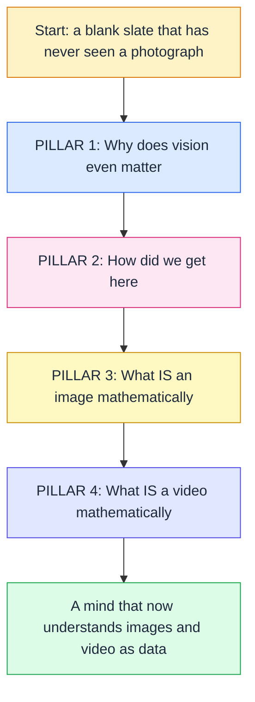
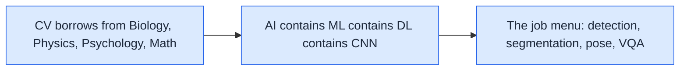
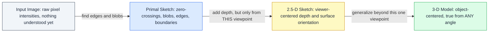
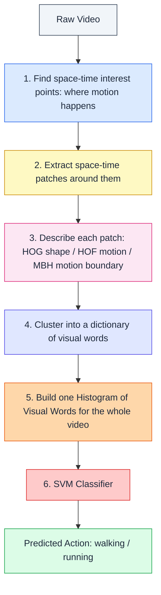

# CV-NLP — Lecture 01: Introduction

### *What is Computer Vision · History of CV · Image Processing Foundations · Video Processing Foundations*

> 🔗 **Repo:** [github.com/rpaut03l/TS-02-03](https://github.com/rpaut03l/TS-02-03) · [CV-NLP Track](../README.md)
>
> **Files in this folder:**
> [📖 THEORY](cvnlp_lec01_intro_theory.md) · [🧮 NUMERICAL](cvnlp_lec01_intro_numerical.md) · [🎯 PRACTICE](cvnlp_lec01_intro_practice.md)

---

## 🧸 What's In This Lecture, Told As One Continuous Story

Picture a completely blank-slate mind that has never seen a photograph before, and this lecture is the process of teaching that mind, piece by piece, how photographs actually work — starting from "why does seeing even matter" all the way to "here is the exact math for sharpening a blurry picture." Nothing is assumed; every idea builds directly on the idea right before it.

That single diagram IS Lecture 1's skeleton. Each pillar below zooms into what's actually inside it.

### Pillar 1 — Why Does Vision Even Matter

### Pillar 2 — How Did We Get Here

### Pillar 3 — What IS an Image, Mathematically

### Pillar 4 — What IS a Video, Mathematically

---

## 📚 Contents of This Lecture Folder

| File | What it covers | Length |
|---|---|---|
| [`cvnlp_lec01_intro_theory.md`](cvnlp_lec01_intro_theory.md) | Full concept walkthrough — 9 topic sections + cheat sheet + full-lecture summary, story-first analogies throughout, formal notation, aligned ASCII diagrams, mnemonics | ~13,200 words |
| [`cvnlp_lec01_intro_numerical.md`](cvnlp_lec01_intro_numerical.md) | Every formula (brightness, contrast, log transform, optical-flow magnitude, spatial filter kernels, histogram counts, JPEG block math, ImageNet error-rate math) worked out digit-by-digit, each section closing with its own short summary | ~7,300 words |
| [`cvnlp_lec01_intro_practice.md`](cvnlp_lec01_intro_practice.md) | The instructor's own in-class Q&A (Q1–Q9, spoiler-tagged, each with an added analogy), 4 extra drill sections, 5 real-world applied scenarios, a hands-on mini project, and a 40-question rapid-fire exam bank | ~6,900 words |

---

## 🔬 Zoom-In #1: Marr's Computational Vision Pipeline

The single most important diagram of the entire lecture — everything else builds context around this one idea. A photograph cannot jump straight from "raw pixels" to "I understand this object" in one leap; it has to pass through fixed intermediate stages.

Notice the labels on the arrows — each arrow is doing real work, not just connecting boxes. The jump from the 2½-D Sketch to the full 3-D Model is the single most commonly misunderstood step in exams: the 2½-D stage only knows what's visible from where the camera is currently standing, while the 3-D stage is a complete, angle-independent fact about the object. Full explanation, with the basketball example and the "why is it called 2½ and not 3" deep dive, lives in [THEORY, Section 3](cvnlp_lec01_intro_theory.md#3-marrs-computational-vision-model).

---

## 🔬 Zoom-In #2: The JPEG Compression Workflow

Every single image that ever gets stored, emailed, or fed into a model passes through some version of this pipeline first.

The trick worth remembering: Step 1 deliberately separates brightness from color specifically so Step 2 can afford to throw away far more color detail than brightness detail — because human eyes simply don't notice small color shifts the way they notice small brightness shifts. Full walkthrough, with the exact reasoning and the video-frame (I/P/B) extension of this same idea, lives in [THEORY, Section 8](cvnlp_lec01_intro_theory.md#8-image-processing-foundations).

---

## 🔬 Zoom-In #3: The Classical Video Action-Recognition Pipeline

Before deep learning, this six-step recipe was the standard way to teach a computer to recognize an action (like "walking" or "running") from raw video.

This is essentially "Bag-of-Words" borrowed straight from NLP and applied to chopped-up pieces of video — cluster similar-looking motion patches into named piles, count how many patches from this video landed in each pile, and hand that count sheet to a classifier. Full walkthrough lives in [THEORY, Section 9](cvnlp_lec01_intro_theory.md#9-video-processing-foundations).

---

## 🧭 How to Use This Folder

1. **Read `theory.md` first**, without stopping to memorize — just get the full story straight, using the zoom-in diagrams above as your map of where you are at any given moment.
2. **Work through `numerical.md` with pen and paper.** Every single number is reproducible by hand; if your answer doesn't match, that mismatch is precisely where your gap is.
3. **Attempt `practice.md` before checking any answers.** Every problem is deliberately hidden behind a spoiler tag so you can't accidentally cheat yourself out of real practice.
4. **Use the Cheat Sheet & Exam Hacks** sections (end of `theory.md` and `numerical.md`) for a final review pass the night before anything graded.

---

## 🔭 Where This Lecture Leads Next

Lecture 1 is 100% foundation — there's no heavy hands-on numerical work here like "compute this CNN's output size," because that specific style of assignment starts once the course reaches actual CNN architectures. This folder's `numerical.md` is deliberately built around the formulas *this particular* lecture introduces (brightness, contrast, log transform, optical flow magnitude, spatial-filter convolution, JPEG block counting, error-rate math), so every worked example is genuinely grounded in what was actually taught, rather than being generic filler.

---

## 🧠 Quick-Glance Mnemonic Bank for This Lecture

| Mnemonic | Unpacks to |
|---|---|
| BIOM -> CV -> HIST -> IMG -> VID | The master chant for this entire lecture's 4-pillar structure |
| Bio-Cam-Neuro | Biological vision -> Camera obscura -> Neuroscience specialization |
| P-2½-3: Pixels, Pieces, Position, Presence | Marr's four stages, in order |
| SIFT Spins & Scales, HOG Grids & Points | SIFT vs. HOG, in six words |
| SfM Triangulates, Semantic Groups, Instance Splits | 3D reconstruction + the two segmentation types |
| C-P-I-I -> A-V-G-M -> ViT | Dataset growth -> architecture evolution -> Transformer takeover |
| CLIP Connects, DALL-E Draws | Discriminative matching vs. generative creation |
| C-J-F-B-C-H-D-L-G-S | The full Image Processing Foundations section, in order |
| Flow -> HOG/HOF/MBH -> Bag -> SVM | The full classical video action-recognition pipeline |

---

> **Next:** [📖 THEORY →](cvnlp_lec01_intro_theory.md)
>
> *CV-NLP · Lec 01 · github.com/rpaut03l/TS-02-03*
