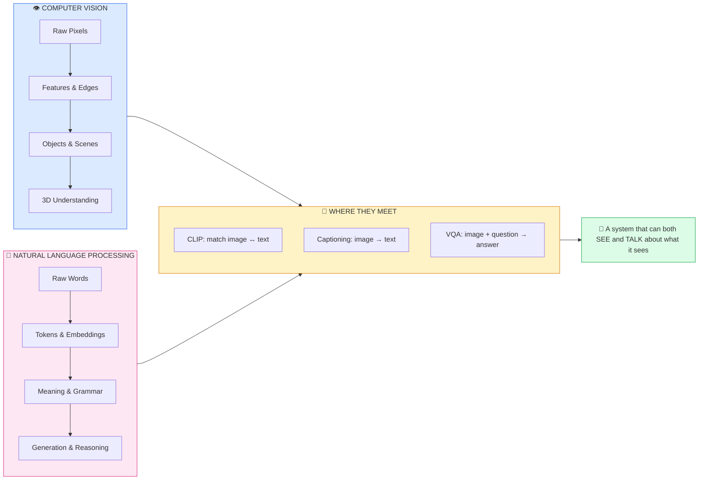
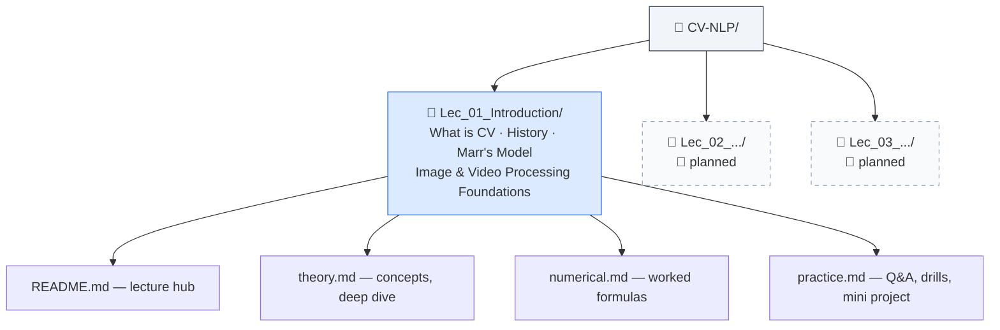
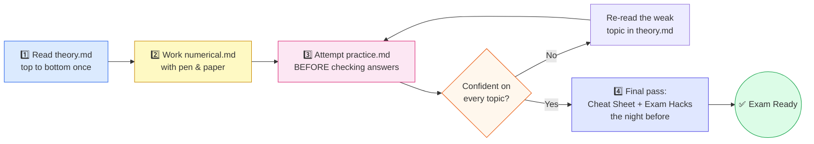
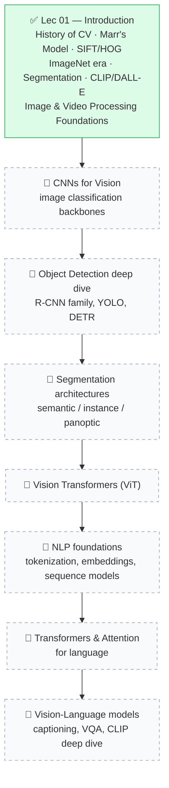

# CV-NLP (Foundation of Vision and Language)

### *Computer Vision & NLP foundations — notes, worked numbers, and practice*

> 🔗 **Repo:** [github.com/rpaut03l/TS-02-03](https://github.com/rpaut03l/TS-02-03) · CV-NLP Track
>
> **Instructor:** Divya Saxena (Assistant Professor, School of AI and Data Science, IIT Jodhpur) · Co-instructors: Sidharth Ranjan, Deeksha Varshney
> **Schedule:** Friday 6:00–7:30 pm · Saturday 2:30–4:00 pm · Google Classroom code `uf5jyhal`
>
> **Style:** Every topic explained with a picture-first walkthrough, then the formal definitions, then fully worked numbers, then self-test practice. Same trio pattern used across this repo's Advanced-AI, MLOps, and GPU Programming tracks.

---

## 🗺️ The Big Picture — What This Whole Track Is Building Toward

Teaching a machine to genuinely understand the world takes two separate superpowers working together: the power to **see** (Computer Vision) and the power to **understand language** (NLP). Neither superpower is useful alone — a system that can see a photo of a dog but can't say the word "dog," or a system that can talk about dogs fluently but has never actually looked at one, is only doing half the job. This track builds both superpowers, lecture by lecture, and ends by fusing them together.

Think of this the way a small child learns: first she notices shapes and colors around her (that's the Computer Vision arm — raw pixels slowly turning into recognized objects), separately she starts picking up sounds and words from the people around her (that's the NLP arm — raw sounds slowly turning into recognized meaning). At some point, and this is the magic moment, she connects the two: she looks at the family pet and says "dog" for the very first time. That single moment — vision and language locking together into one understanding — is exactly what CLIP, captioning, and VQA do computationally, and it's exactly why this track carries both halves in its name.

---

## 📁 Contents of This Folder

| # | Lecture | Folder |
|---|---|---|
| 1 | **Introduction — What is CV, History of CV, Image & Video Processing Foundations** — interdisciplinary roots of CV, Marr's Computational Vision model, classical feature detectors (SIFT, HOG), the ImageNet/AlexNet/VGG/GoogLeNet era, semantic vs instance segmentation, CLIP & DALL-E, color models, JPEG compression, image enhancement (histograms, log transform, gray-level slicing, spatial filtering), video compression (I/P/B frames), optical flow, HOF, MBH, Bag-of-Space-Time-Features + SVM action recognition | [Lec_01_Introduction/](Lec_01_Introduction/) |

Each lecture folder always contains the same **trio** of files, plus a folder-level hub `README.md`:

| File | Purpose |
|---|---|
| `*_theory.md` | Concepts explained with a story-first walkthrough — analogies, aligned ASCII diagrams, exact formal notation, then real technical depth |
| `*_numerical.md` | Every formula worked out with real numbers, one careful step at a time — the numeric backbone for exam-style problems |
| `*_practice.md` | Self-test problems with spoiler-tag answers (including the lecturer's own in-class Q&A), plus a rapid-fire exam Q&A bank and an open-ended mini project |

---

## 🧭 How to Use This Folder — A Study Workflow

This loop is deliberately built the way any real skill gets learned — not by reading once and hoping it sticks, but by reading, then doing, then testing, then circling back to whatever didn't stick the first time. A useful comparison: nobody learns to ride a bicycle by reading an instruction manual once. You read the basics, you actually try pedaling (the numerical file), you fall over a few times and get back up (the practice file's self-check), and you circle back to whichever specific balance problem kept tripping you up, until eventually the whole thing feels automatic.

---

## 📚 Topic Roadmap

More lecture folders will be added as the course progresses — new folders slot in as `Lec_02_...`, `Lec_03_...`, following the exact same trio pattern, and each new addition gets a fresh row in the contents table above plus a tick on this roadmap.

---

## 🔗 External Resources & Cross-References

### 📘 Companion Trimester-1 repo (TS-01)
- **[TS-01 / ML — algorithm fundamentals](https://github.com/rpaut03l/TS-01/tree/main/ML)** — this CV-NLP track assumes comfort with the ML basics documented there (feature spaces, classifiers like SVM, the bias/variance vocabulary used when discussing HOG+SVM action recognition in Lec 01).
- **[TS-01 / AI](https://github.com/rpaut03l/TS-01/tree/main/AI)** — search and reasoning fundamentals; useful background for later CV-NLP lectures that touch on structured prediction.

### 📖 This repo's sibling tracks
- **[DLOps/](../DLOps/)** — PyTorch mechanics (Datasets/DataLoaders, custom training loops) that you'll directly reuse when you start training the CNNs and ViTs this track eventually covers.
- **[MLOps/](../MLOps/)** — once CV models exist, MLOps covers how to track, package, and deploy them.
- **[GPU Programming/](../GPU%20Programming/)** — CV models are GPU-hungry (convolutions, DCT-like transforms); the CUDA/memory-hierarchy material there explains *why* GPUs matter for the pipelines in this track.

### 📖 Primary sources referenced in Lec 01
- David Marr, *Vision* (1982) — the Computational Vision framework (Primal Sketch → 2½-D Sketch → 3-D Model).
- Lowe, D. — SIFT: [cs.ubc.ca/~lowe/papers/iccv99.pdf](https://www.cs.ubc.ca/~lowe/papers/iccv99.pdf)
- Dalal & Triggs — HOG (CVPR 2005), archived at [web.archive.org](https://web.archive.org/web/20110408220331/http://www.acemedia.org/aceMedia/files/document/wp7/2005/cvpr05-inria.pdf)
- Deng et al., *ImageNet: A Large-Scale Hierarchical Image Database*, CVPR 2009; Russakovsky et al., IJCV 2015 (ILSVRC)
- Lin et al. — COCO dataset: [cocodataset.org](https://cocodataset.org/)
- OpenAI — CLIP (Jan 2021) and DALL-E blog posts
- Gupta et al. — LVIS instance segmentation dataset: [lvisdataset.org](https://www.lvisdataset.org/explore)

---

## 🧠 One-Screen Mnemonic Bank (Track-Level)

| Mnemonic | Unpacks to |
|---|---|
| BIOM -> CV -> HIST -> IMG -> VID | Biology/Image-processing/Optics/Math feed CV; CV's History runs Marr-to-CLIP; then Image math; then Video math |
| P-2½-3: Pixels, Pieces, Position, Presence | Marr's four stages, in order |
| SIFT Spins & Scales, HOG Grids & Points | Which classical feature detector to reach for, and why |
| SfM Triangulates, Semantic Groups, Instance Splits | The 3D-reconstruction and segmentation trio |
| C-P-I-I -> A-V-G-M -> ViT | Datasets grew (Caltech/PASCAL/ImageNet/ILSVRC) -> architectures evolved (AlexNet/VGG/GoogLeNet/ResNet) -> Transformers took over |
| CLIP Connects, DALL-E Draws | Discriminative matching vs. generative creation |
| C-J-F-B-C-H-D-L-G-S | Color, JPEG, Frames, Brightness, Contrast, Histogram, Dynamic range, Log, Gray-slice, Spatial filter |
| Flow -> HOG/HOF/MBH -> Bag -> SVM | The entire classical video action-recognition pipeline in one arrow chain |

---

*Some figures/explanations in the source lecture slides are themselves adapted from public academic resources — all original-author credit is preserved in each theory file's citation notes. This repo's write-ups are original explanatory text, not slide reproductions.*
