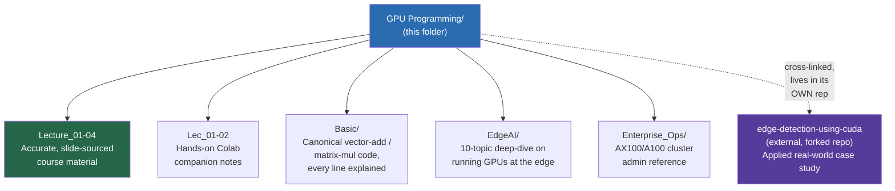
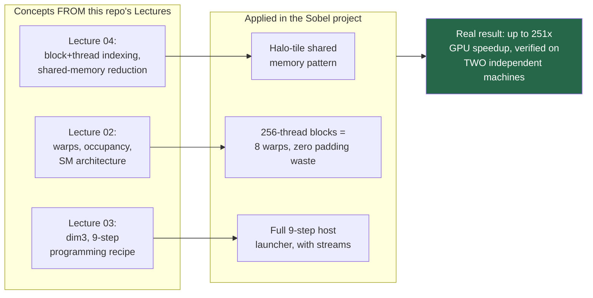
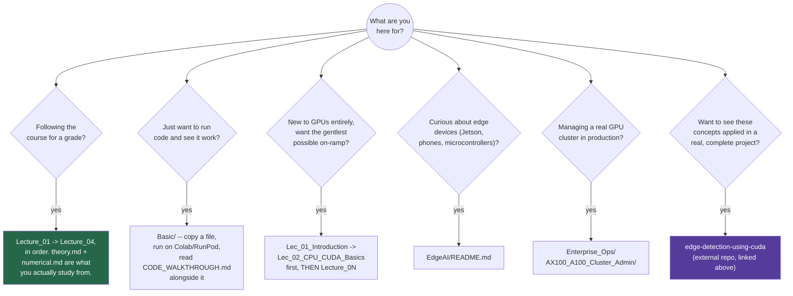
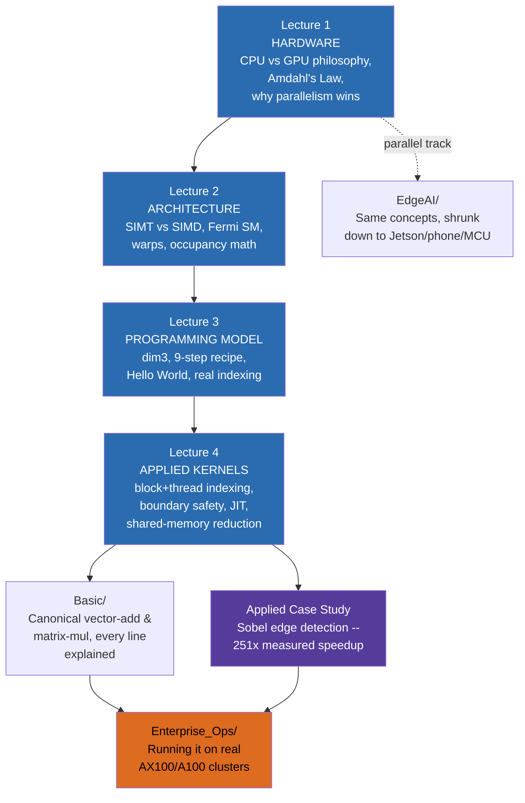

#  GPU Programming

### *How to make a computer do a million things at the same time — notes, code, and practice*

> 🔗 **Repo:** [github.com/rpaut03l/TS-02-03](https://github.com/rpaut03l/TS-02-03) · GPU Programming track
>
> **Style:** Every topic explained (easy story + picture), then deeper technical details, then real runnable code.

---

##  What even is a GPU?

### 👶 Easy Story
Imagine a **kitchen** that has to cook dinner for 1000 people.

- **Option A — one super-chef.** Very smart, very fast, can do anything — chop, sauté, plate, decorate. But she can only cook **one dish at a time**. That's a **CPU** (Central Processing Unit). Great at hard, branchy, "thinking" tasks. Bad at doing 1000 copies of the same easy task.

- **Option B — an army of 1000 line-cooks.** Each one isn't as smart as the super-chef. They can only follow simple instructions like "chop this onion." But there are **a thousand of them**, and they all chop at the same time. In the time the super-chef chops 1 onion, they chop **1000**. That's a **GPU** (Graphics Processing Unit).

### The big idea
> **GPUs are not "faster CPUs." They are "wider" CPUs.**

Each GPU core is much simpler than a CPU core — but a GPU has *thousands* of them and runs them in **parallel**. That's why GPUs crush tasks like graphics (every pixel can be computed independently) and deep learning (every matrix entry can be computed independently).

```
 CPU:   few VERY smart cores     → sequential, branchy work
 GPU:   thousands of simple cores → massively parallel, uniform work
```

---

## 🗺️ Map of This Entire Repo Track

Before diving into any single folder, here's how everything in `GPU Programming/` actually connects — including one piece that lives OUTSIDE this repo entirely:



**The key thing this diagram shows:** everything solid-connected above lives INSIDE this `TS-02-03` repo. The one dotted connection — the Sobel edge-detection project — is deliberately kept in its OWN separate repository (forked from its original MIT-licensed author) rather than copied in here, for the authorship and licensing reasons explained in [§ Related — Applied Case Study](#-related--applied-case-study) below. Linking out, not merging in, is the correct way to reference someone else's work from your own notes repo.

---

## 🧭 Two tracks live in this folder — read this first

This repo has **two parallel sets of lecture folders**, and telling them apart matters:

| Naming pattern | What it is | Source | Best for |
|---|---|---|---|
| **`Lecture_0N_...`** | Accurate transcription + deep-dive of the **actual course slides** (Prof. Binod Kumar) | Real uploaded lecture PDFs | Exam prep, assignments, anything graded |
| **`Lec_0N_...`** | Earlier hands-on, Colab-runnable companion notes, written before the real slides were available | General CUDA knowledge, not slide-sourced | Building intuition, extra practice, running code for fun |

**When in doubt, `Lecture_0N_...` is the one that matches what's actually being taught.** `Lec_0N_...` is kept because it's still useful supplementary material, not because it duplicates the same content.

---

## 📁 Contents of this folder

### 🎓 Course lectures — accurate, slide-sourced (`Lecture_0N`)

| # | Lecture | What's inside | Folder |
|---|---|---|---|
| 1 | **GPU Fundamentals & Hardware Accelerators** | Hardware platform landscape (CPU/GPU/TPU/NPU/FPGA/ASIC), CPU vs GPU design philosophy, memory hierarchy, Amdahl's Law derived + worked, real case studies (battery thermal sim, CNN inference benchmarks), the accelerator flexibility-vs-efficiency spectrum | [Lecture_01_GPU_Fundamentals_Hardware_Accelerators/](Lecture_01_GPU_Fundamentals_Hardware_Accelerators/) |
| 2 | **CUDA Programming Model, SIMT & Fermi Architecture** | CUDA↔OpenCL terminology, SIMT vs SIMD, GPU microarchitecture, the Fermi Streaming Multiprocessor in full detail, warps, a fully worked occupancy calculation, latency×throughput scheduling math, memory hierarchy, kernel launch syntax | [Lecture_02_CUDA_Programming_Model_SIMT_Fermi/](Lecture_02_CUDA_Programming_Model_SIMT_Fermi/) |
| 3 | **Thread Hierarchy, Memory & Your First Kernel** | The 9-step GPU programming recipe, `dim3`, a fully worked grid/block index problem, real Fermi hardware specs, Hello World with actual device code, hands-on runnable exercises | [Lecture_03_Thread_Hierarchy_Memory_HelloWorld/](Lecture_03_Thread_Hierarchy_Memory_HelloWorld/) |
| 4 | **Vector/Matrix Kernels & Indexing** | Block-only → block+thread indexing, boundary-safe kernels for arbitrary sizes, host/device synchronization, JIT compilation (Numba/CuPy/PyCUDA), matrix multiplication as N² independent inner products, shared-memory reduction, hands-on runnable exercises | [Lecture_04_Vector_Matrix_Kernels_Indexing/](Lecture_04_Vector_Matrix_Kernels_Indexing/) |

Each `Lecture_0N` folder follows the same four-file structure:

| File | Purpose |
|---|---|
| `*_theory.md` | Baby-story opener → formal concepts → ASCII diagrams → cheat sheet → exam hacks |
| `*_numerical.md` | Every worked example rebuilt from first principles, step by step, with multiple additional practice problems |
| `*_code.md` *(Lec 3 & 4)* | Hands-on runnable exercises — paste into Colab/RunPod, see the real output, break things on purpose to see why guardrails matter |
| `*_practice.md` | Self-test Q&A, rapid-fire true/false rounds, full multi-part sample exam questions with marks breakdowns |

---

### 🧩 Basic — the canonical code, every line explained

| Folder | What's inside |
|---|---|
| [Basic/](Basic/) | The two textbook programs — **Vector Addition** and **Matrix Multiplication** — in CUDA C++ and three Python flavors (Numba, PyCUDA, CuPy), plus [`CODE_WALKTHROUGH.md`](Basic/CODE_WALKTHROUGH.md), which explains **every single line** of every file for someone who's never read CUDA before |

```
Basic/
├── README.md
├── CODE_WALKTHROUGH.md
├── cpp/
│   ├── 01_vector_add.cu
│   └── 02_matrix_mul.cu
└── python/
    ├── 01_vector_add_numba.py
    ├── 02_matrix_mul_pycuda.py
    └── 03_matrix_mul_cupy.py
```

---

### 🏭 Enterprise Ops — production GPU cluster administration

*(Self-study, not from the course — real-world sysadmin/infra skills that build directly on everything above.)*

| Folder | What's inside |
|---|---|
| [Enterprise_Ops/AX100_A100_Cluster_Admin/](Enterprise_Ops/AX100_A100_Cluster_Admin/) | A 290+ command deep-dive reference for managing AX100/A100 GPU clusters: `nvidia-smi` monitoring & MIG/ECC/power/clock management, `nvcc`/MPS, VRAM reclamation & node recovery, NVLink/fabric topology, kernel module & driver interrogation, NUMA/AVX-512 tuning, NCCL/UVM environment variables, Nsight Systems/Compute profiling, PyTorch assertion snippets, NVMe I/O monitoring, InfiniBand/RoCE diagnostics — **plus an appendix walking through a real, live-captured terminal session on an actual A100-SXM4-80GB node**, including a command that fails and exactly why |

---

### 🌐 EdgeAI — running GPUs at the edge

*(Self-study deep-dive, not a lecture — the natural next step after learning desktop/datacenter GPU programming.)*

| Topic | What's inside | Folder |
|---|---|---|
| **Fundamentals** | What Edge AI is, why it matters, where it fits (Cloud AI vs Edge AI trade-offs) | [EdgeAI/Fundamentals/](EdgeAI/Fundamentals/) |
| **Hardware (beyond GPUs)** | The non-GPU chips — NPUs, MCUs, FPGAs — plus the Edge-vs-Cloud GPU comparison table | [EdgeAI/Hardware/](EdgeAI/Hardware/) |
| **GPU Types** | Every variety of GPU that shows up on the edge — Jetson, discrete, integrated GPU, mobile SoC | [EdgeAI/GPU_Types/](EdgeAI/GPU_Types/) |
| **CUDA for the Edge** | How CUDA changes moving from desktop to Jetson — JetPack, TensorRT, unified memory, DeepStream | [EdgeAI/CUDA_for_Edge/](EdgeAI/CUDA_for_Edge/) |
| **Model Compression** | Shrink the model, speed it up, keep the accuracy — quantization, pruning, distillation | [EdgeAI/Model_Compression/](EdgeAI/Model_Compression/) |
| **Deployment Frameworks** | TensorFlow Lite, ONNX Runtime, OpenVINO — the three runtimes that matter | [EdgeAI/Deployment_Frameworks/](EdgeAI/Deployment_Frameworks/) |
| **TinyML** | AI that runs on a button-cell battery — microcontrollers, kilobytes, milliwatts | [EdgeAI/TinyML/](EdgeAI/TinyML/) |
| **Federated Learning & On-Device Training** | Learn from everyone's data, without anyone's data ever leaving their device | [EdgeAI/Federated_Learning/](EdgeAI/Federated_Learning/) |
| **Security & Privacy** | Secure boot, encrypted weights, adversarial attacks, side channels, regulations | [EdgeAI/Security_Privacy/](EdgeAI/Security_Privacy/) |
| **Edge MLOps** | Ship, update, monitor, roll back — models that live in millions of devices | [EdgeAI/Edge_MLOps/](EdgeAI/Edge_MLOps/) |

Start at [EdgeAI/README.md](EdgeAI/README.md) for the full orientation (the Cloud-vs-Edge homework analogy, and why Edge AI lives inside a GPU Programming repo at all), and see [EdgeAI/TODO_NEXT.md](EdgeAI/TODO_NEXT.md) for what's planned next in this sub-track.

Every EdgeAI topic folder follows the same theory → code → practice trio as the main lectures (e.g. `edge_ai_fundamentals_theory.md`, `edge_ai_fundamentals_code.md`, `edge_ai_fundamentals_practice.md`).

---

### 🧑‍🏫 Hands-on companion lectures (`Lec_0N`, pre-slide-upload material)

| # | Topic | Folder |
|---|---|---|
| 1 | **Introduction to GPUs** — hardware families overview, memory hierarchy, Amdahl's Law, why GPUs for AI (general, Colab-runnable companion — not slide-sourced) | [Lec_01_Introduction/](Lec_01_Introduction/) |
| 2 | **CPU Basics · CUDA Programming Model · GPU Architecture** — ISA, threads/blocks/grids, warps, SIMT vs SIMD, memory hierarchy, full workload flow (general, Colab-runnable companion — not slide-sourced) | [Lec_02_CPU_CUDA_Basics/](Lec_02_CPU_CUDA_Basics/) |

Each follows the theory → code → practice trio, with `practice.md` built as a paste-into-Colab notebook rather than a Q&A set — useful for building hands-on muscle memory alongside the accurate `Lecture_0N` material above.

---

## 🔗 Related — Applied Case Study

Everything above is course notes, reference material, or hands-on practice built INSIDE this repo. This one is different: a **complete, independently-buildable CUDA application** applying the exact concepts taught in `Lecture_01`–`Lecture_04` to a real computer-vision workload — kept in its own separate repository rather than copied in here (see the diagram at the top of this file for why).

**[edge-detection-using-cuda](https://github.com/rpaut03l/edge-detection-using-cuda)**
*(forked from [Salik-Devv/edge-detection-using-cuda](https://github.com/Salik-Devv/edge-detection-using-cuda), original work by Mohammad Salik Dev, MIT License — with an added deep-dive documentation bundle: full code walkthrough, cloud GPU setup guide for RunPod/AWS/GCP/NVIDIA Brev, an independently verified benchmark run, and a next-level roadmap)*



**What's in that repo's documentation bundle**, if you want the short version before clicking through:

| Document | What it covers |
|---|---|
| `README.md` | Full project deep-dive — theory, architecture, real benchmark numbers, profiling results |
| `CODE_WALKTHROUGH.md` | Every single line of every source file explained (`CMakeLists.txt` through `plot_results.py`) |
| `SETUP_AND_RUN.md` | Complete requirements list, install commands, build steps, troubleshooting |
| `CLOUD_GPU_SETUP.md` | Step-by-step for RunPod.io, AWS EC2, GCP Compute Engine, and the full NVIDIA Brev CLI (install → create → connect → port-forward → teardown) |
| `HOW_THIS_WORKS_SIMPLY.md` | The same ideas with zero code, zero jargon — pure plain-language explanation |
| `REAL_RUN_VERIFIED.md` | An independent benchmark run on completely different hardware, cross-checked against the original author's numbers |
| `NEXT_LEVEL.md` | A prioritized roadmap of genuine remaining optimizations (with the original project's own stale "future work" claims corrected) |
| `PUBLISH_TO_GITHUB.md` | How this fork itself was published, respecting the MIT license — the exact reasoning behind keeping it separate from this repo |

---

## 🧭 How to use this repo



1. **Following the course for a grade?** Go straight to `Lecture_01` → `Lecture_04`, in order. Each folder's `theory.md` and `numerical.md` are what you'd actually study from.
2. **Want to just run code and see it work?** Start with [Basic/](Basic/) — copy any file, run it on Colab or RunPod, and read [CODE_WALKTHROUGH.md](Basic/CODE_WALKTHROUGH.md) alongside it.
3. **New to GPUs entirely, want the gentlest possible on-ramp?** `Lec_01_Introduction` → `Lec_02_CPU_CUDA_Basics` first, then move into the `Lecture_0N` series once the basic shape feels familiar.
4. **Curious about edge devices (Jetson, phones, microcontrollers)?** Start at [EdgeAI/README.md](EdgeAI/README.md).
5. **Managing a real GPU cluster in production?** [Enterprise_Ops/AX100_A100_Cluster_Admin/](Enterprise_Ops/AX100_A100_Cluster_Admin/) is the reference to keep open in a second tab.
6. **Want to see these concepts applied in a real, complete, independently-benchmarked project?** [edge-detection-using-cuda](https://github.com/rpaut03l/edge-detection-using-cuda) — see § above.

> 💡 **No physical GPU needed for anything in this repo.** Google Colab's free tier gives you a real NVIDIA T4 GPU with CUDA pre-installed; RunPod.io gives you on-demand access to specific GPU models (including A100-class) by the hour. Everything here is designed to run on either. For a full multi-platform comparison (RunPod, AWS, GCP, NVIDIA Brev), see `CLOUD_GPU_SETUP.md` in the linked case-study repo above.

---

## 📚 Topic Roadmap

### GPU Core Concepts — How the Four Lectures Build on Each Other



**The progression in one sentence each:** Lecture 1 asks "why parallel hardware at all," Lecture 2 opens up exactly what that hardware looks like inside, Lecture 3 hands you the actual syntax to talk to it, and Lecture 4 puts it all to work on real block+thread-indexed kernels — everything below this point (`Basic/`, the Sobel case study, `Enterprise_Ops/`) is that same foundation applied to something bigger.

### Status

| Status | Item | What it covers | Link |
|:---:|---|---|---|
| ✅ | **Lecture 1** | GPU Fundamentals & Hardware Accelerators — CPU vs GPU philosophy, Amdahl's Law, hardware platform landscape | [Lecture_01_GPU_Fundamentals_Hardware_Accelerators/](Lecture_01_GPU_Fundamentals_Hardware_Accelerators/) |
| ✅ | **Lecture 2** | CUDA Programming Model, SIMT & Fermi Architecture — warps, occupancy, the Fermi SM in full detail | [Lecture_02_CUDA_Programming_Model_SIMT_Fermi/](Lecture_02_CUDA_Programming_Model_SIMT_Fermi/) |
| ✅ | **Lecture 3** | Thread Hierarchy, Memory & Your First Kernel — `dim3`, the 9-step recipe, real Hello World device code | [Lecture_03_Thread_Hierarchy_Memory_HelloWorld/](Lecture_03_Thread_Hierarchy_Memory_HelloWorld/) |
| ✅ | **Lecture 4** | Vector/Matrix Kernels & Indexing — boundary-safe kernels, JIT (Numba/CuPy/PyCUDA), shared-memory reduction | [Lecture_04_Vector_Matrix_Kernels_Indexing/](Lecture_04_Vector_Matrix_Kernels_Indexing/) |
| ✅ | **Basic** | Canonical Vector Add / Matrix Multiply code bundle — every line explained, C++ and 3 Python flavors | [Basic/](Basic/) |
| ✅ | **EdgeAI sub-track** | Full deep-dive on running GPUs at the edge — 10 topics, Jetson to TinyML | [EdgeAI/README.md](EdgeAI/README.md) |
| ✅ | **Enterprise_Ops sub-track** | AX100/A100 cluster administration — 290+ commands, real verified terminal session | [Enterprise_Ops/AX100_A100_Cluster_Admin/](Enterprise_Ops/AX100_A100_Cluster_Admin/) |
| ✅ | **Applied case study** *(external repo)* | Sobel edge detection — shared-memory tiling, constant memory, multi-stream pipelining, up to 251× measured speedup, independently verified on two separate machines | [edge-detection-using-cuda](https://github.com/rpaut03l/edge-detection-using-cuda) |
| 🔭 | Memory optimization deep-dive | Coalescing, shared-memory tiling, in more depth than Lecture 4's introduction | *planned* |
| 🔭 | Reductions, prefix sums, histograms | Beyond the naive reduction shown in Lecture 4 | *planned* |
| 🔭 | Streams, concurrency, multi-GPU | The streams pattern already previewed in the Sobel case study, formalized as its own topic | *planned* |
| 🔭 | Profiling & optimization (`nsys`, `ncu`) | Applied to a full training loop, not just a single kernel | *planned* |
| 🔭 | Case studies | Following the course textbook's later chapters | *planned* |

**Reading the ✅/🔭 split:** everything with a ✅ is built, pushed, and linked above — genuinely done, not "mostly done." Everything with a 🔭 is an explicitly identified next step, not a vague someday — several of these (streams, memory tiling) are concepts you've ALREADY seen working in the linked Sobel case study; the planned items here would formalize them as standalone course-style lecture material rather than leaving them only inside that applied example.

---

## 🔗 Useful links for self-study

- [NVIDIA CUDA Programming Guide](https://docs.nvidia.com/cuda/cuda-c-programming-guide/) — authoritative reference
- [NVIDIA CUDA by Example (free PDF chapters)](https://developer.nvidia.com/cuda-example) — gentle intro
- [Numba CUDA documentation](https://numba.readthedocs.io/en/stable/cuda/index.html) — Python-first CUDA
- [CuPy](https://docs.cupy.dev/) — NumPy API on the GPU
- [Google Colab](https://colab.research.google.com) — free CUDA-capable GPU
- [RunPod.io](https://www.runpod.io) — on-demand GPU rental, pick your exact GPU model
- [NVIDIA Brev](https://docs.nvidia.com/brev) — NVIDIA's own multi-cloud GPU instance CLI/platform
- [edge-detection-using-cuda](https://github.com/rpaut03l/edge-detection-using-cuda) — this track's applied case study (see § above)

---

> *github.com/rpaut03l/TS-02-03*
